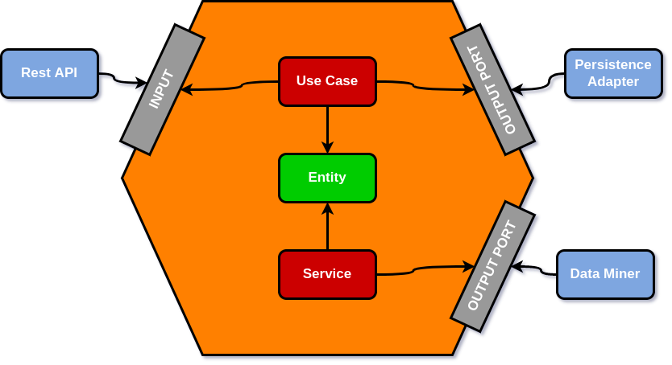

### [_<< ReadMe_](README.md)

---

# Arquitetura
### _Tecnologias e Frameworks utilizados:_
- Linguagem JAVA versão 11
- Banco de dados Postgres
- Spring boot e cloud
- OpenAPI para documentação das APIs
- OpenFeign para integração com APIs externas
- Docker
- AWS CloudWatch

### _Modelo de Arquitetura:_
- SOLID (Single Responsibility Principle, Open Closed Principle, Liskov Substitution Principle, Interface Segregation Principle e Dependency Inversion Principle)
- OOP (Programação Orientada a Objetos)
- DTO (Data Transfer Object)
- Microserviço
- Ports and Adapters Architecture
  - Conhecida como Arquitetura Hexagonal ou arquitetura de portas e adaptadores, tem como objetivo tornar todos os componentes do software fracamente acoplados, tornando de fácil substituição e facilitando na automação de teste. Com essa abordagem, podemos trocar facilmente as diferentes camadas do aplicativo. A ideia da Arquitetura Hexagonal é colocar entradas e saídas nas bordas de nosso design. A lógica de negócios não deve depender de expormos uma API REST e não deve depender de onde obtemos os dados.
    
---

  

    
  

