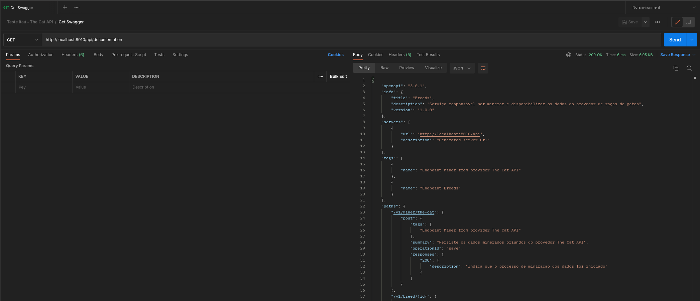
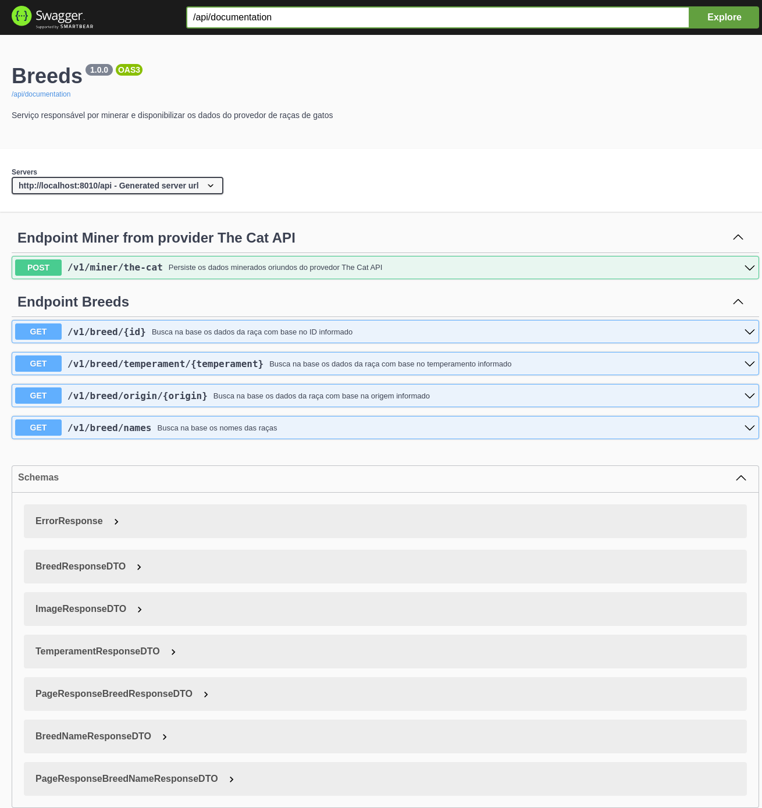
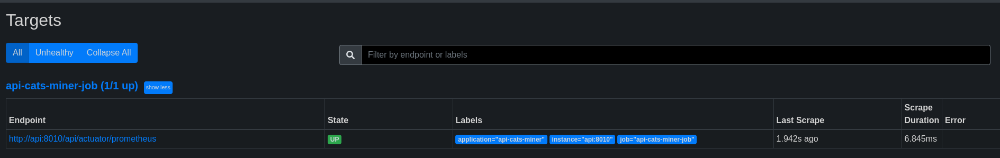
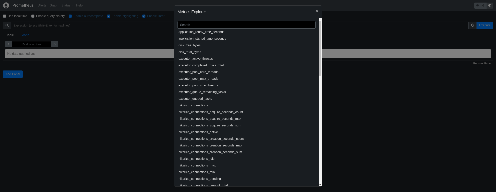
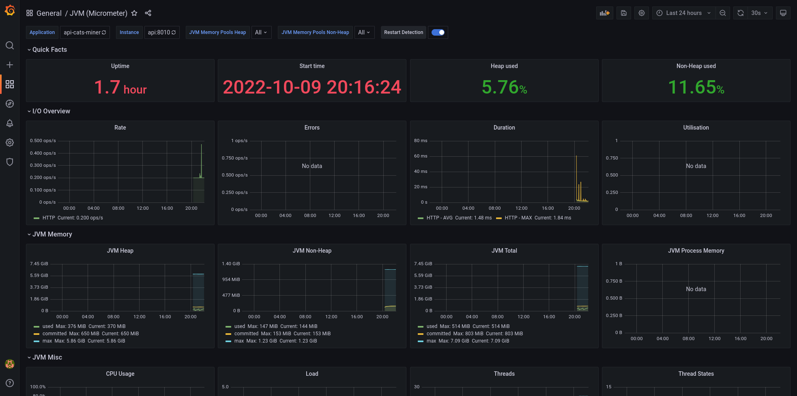
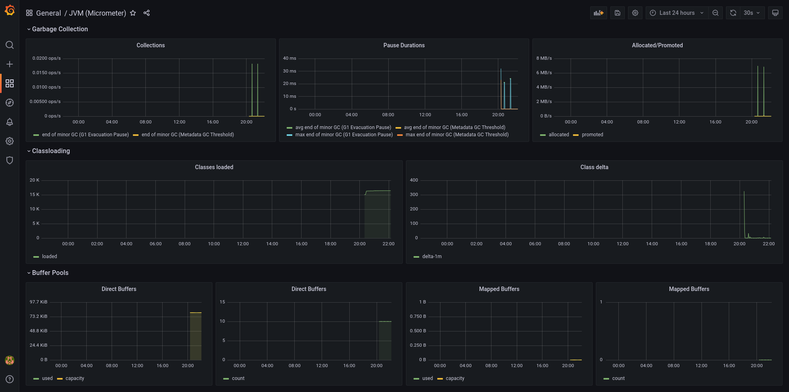
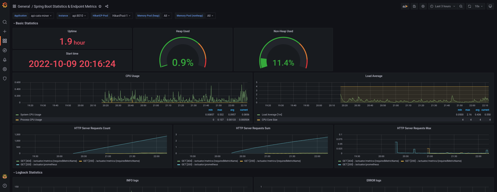
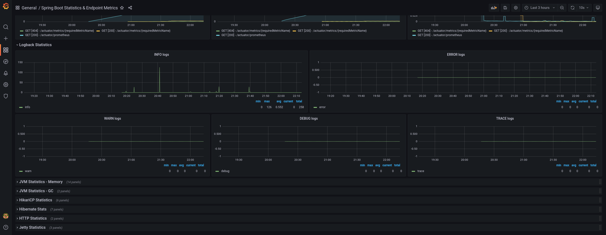
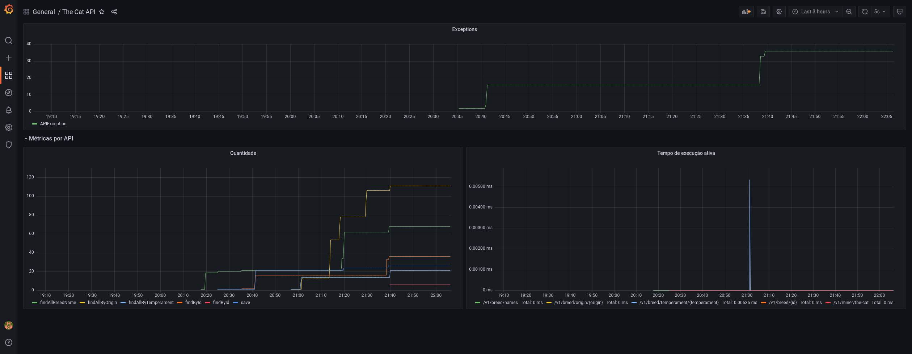

### [_<< ReadMe_](../README.md)

---

# Documentação
_Existe duas forma de acessar a documentação das APIs e obter todos os detalhes de schemas, methods, requestBody, responseBody e status:_
- Via request: [http://server:port/context-path/documentation](http://server:port/context-path/documentation)
  - ```server:``` The server name or IP
  - ```port:``` The server port (default 8010)
  - ```context-path:``` The context path of the application (default /api)
  - 
- Via UI: [http://server:port/context-path/swagger-ui/index.html](http://server:port/context-path/swagger-ui/index.html)
  - ```server:``` The server name or IP
  - ```port:``` The server port (default 8010)
  - ```context-path:``` The context path of the application (default /api)
  - 


# Rodando a aplicação

### Pré-requisito
- Ter o docker instalado na maquina

1 - A aplicação esta usando docker com isso para rodar a aplicação basta ir na pasta raiz e rodar o comando ```sudo docker-compose up -d``` o mesmo irá executar as seguintes etapas:
- Buildar a aplicação
- Configurar a rede interna
- Vincular as dependências entre os serviços de banco de dados e API
- Baixar todas as imagens necessárias incluindo o Java 11 e o banco de dados Postgres
- Rodar o script inicial para a criação das tabelas
- Iniciar a aplicação na porta 8010

2 - Rodar o comando ```sudo docker-compose ps``` para verificar se o "State" está UP ou simplesmente chamar o health check que foi disponibilizado na colection do postman

3 - Chamar o endpoint [Miner breeds from The Cat API](http://localhost:8010/api/v1/miner/the-cat)

4 - Executar as demais APIs

### Analisando o log da aplicação via docker
1 - Entrar na raiz do projeto

2 - Executar o comando  ```sudo docker logs -f api```

### Parando a aplicação
1 - Entrar na raiz do projeto

2 - Executar o comando para listar todos os containers  ```sudo docker ps```

3 - Executar o comando  ```sudo docker stop <container>```

### Acessando o prometheus
1 - Acessar via browser o [link](http://localhost:9090)

2 - Entrar em Status > Targets e irá apresentar o status do job em execução, a porta, labels e tempo de ultimo scrape
 

3 - Entrar na home e executar alguma métrica disponível


### Acessando o grafana
1 - Acessar via browser o [link](http://localhost:3000)

2 - Importar dashboards da comunidade ou criar o seu próprio.

3 - Segue exemplos extraídos da propria api




